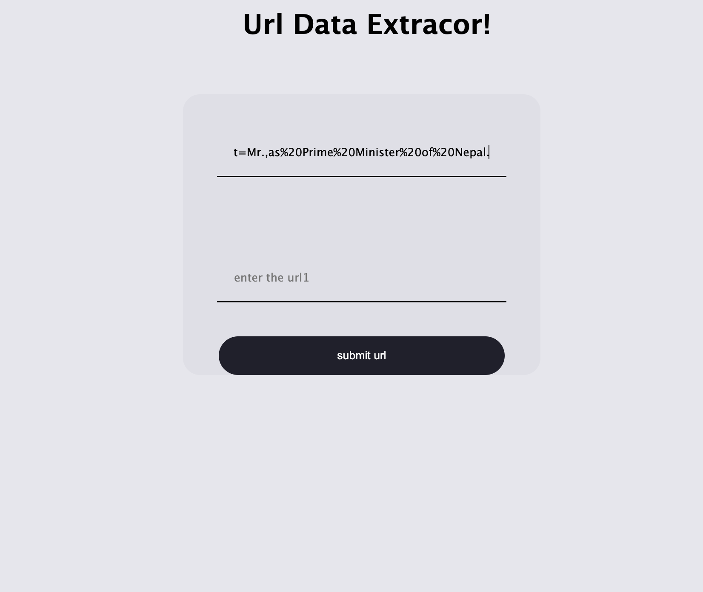
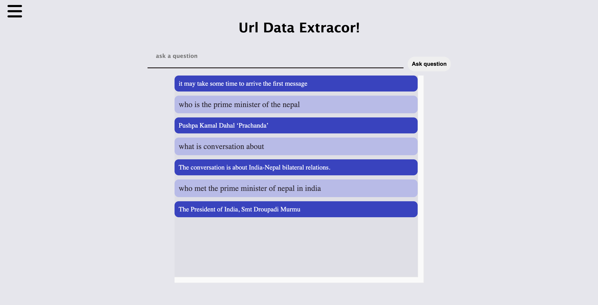

## About The Url extractor 
This application, built with Google Palm, serves as a URL extractor, allowing users to input multiple URLs for data extraction. Users can also pose questions, and the app provides responses based on the extracted data

## Technologies Used
. Django as the backend framework. 

. HTML, CSS, and JavaScript for frontend development.

. AJAX for smooth request and response interactions.

. LangChain framework for efficient data extraction.

. Integration with Google Palm for enhanced capabilities.


###  INSTALLATION


## CLONE THE PROJECT 
```bash
  
```

## DOWNLOAD THE REQUIREMENTS 
```bash
cd url extraction

pip install -r requirements.txt
```

## RUN THE SERVER 
```bash

python manage.py runserver 

```




